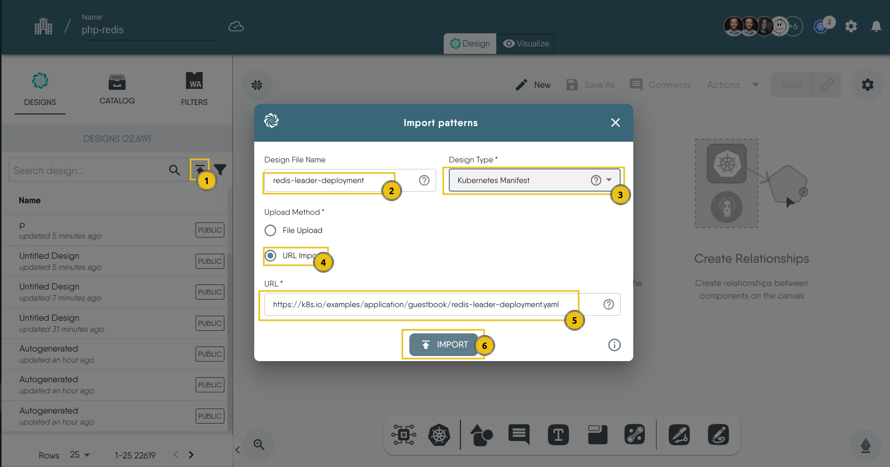
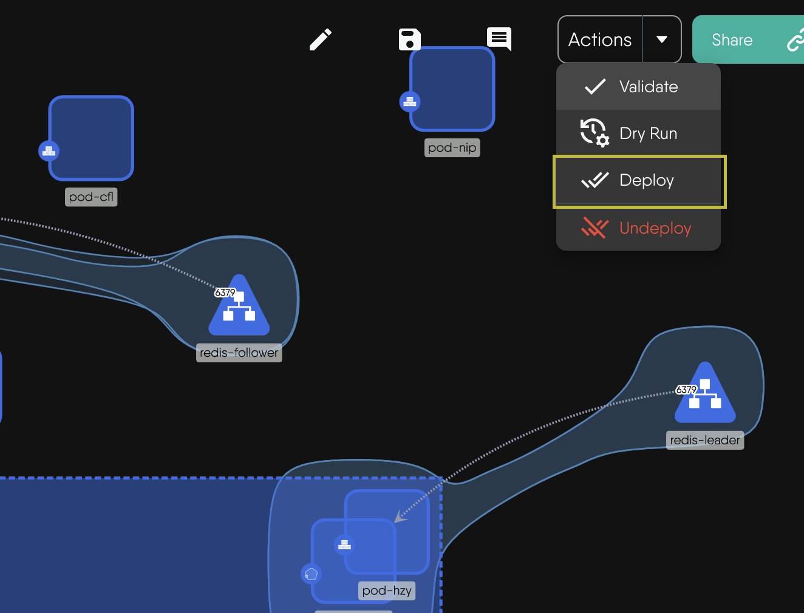
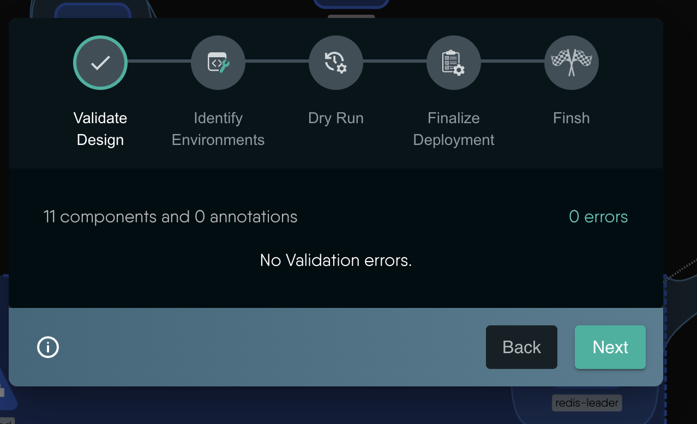
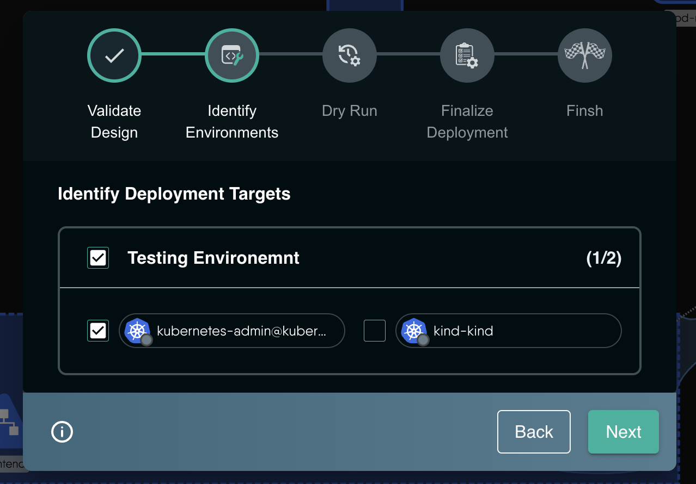
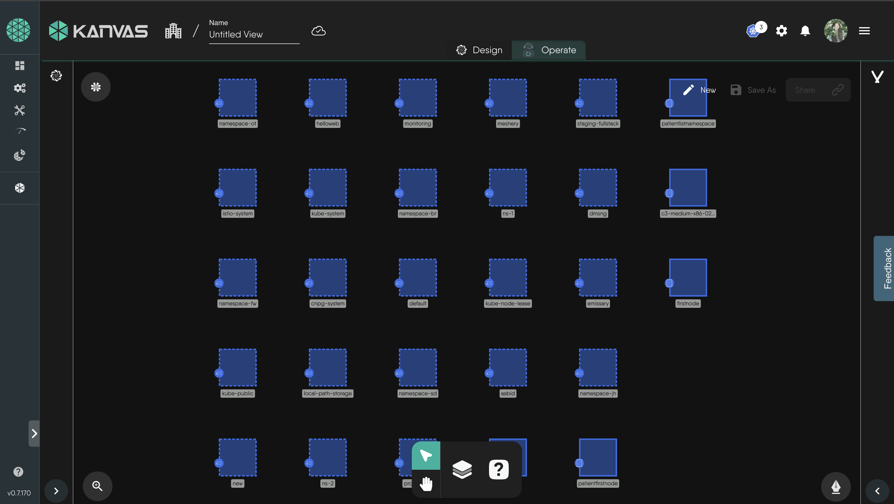
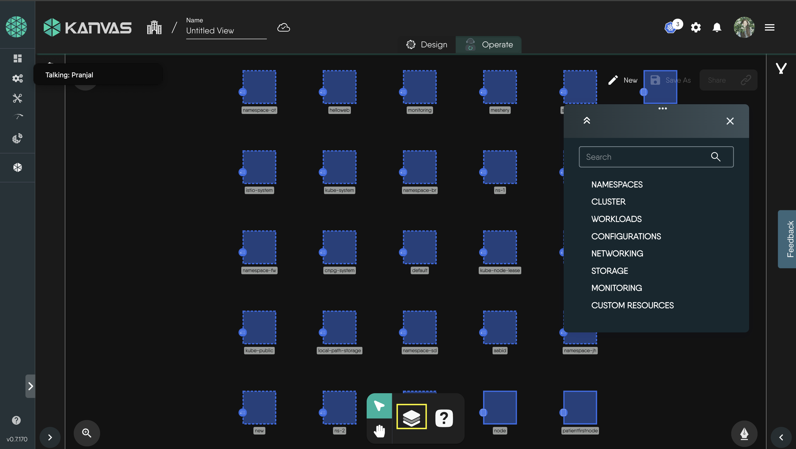
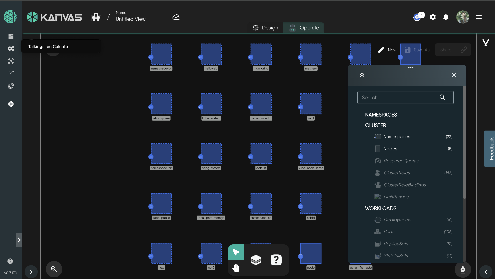
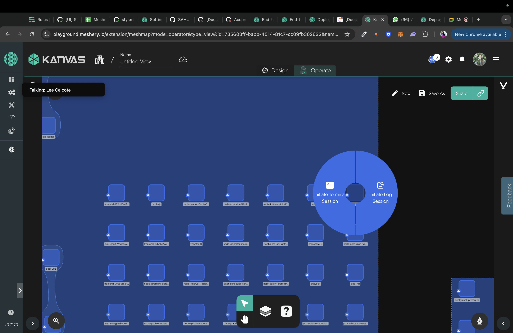
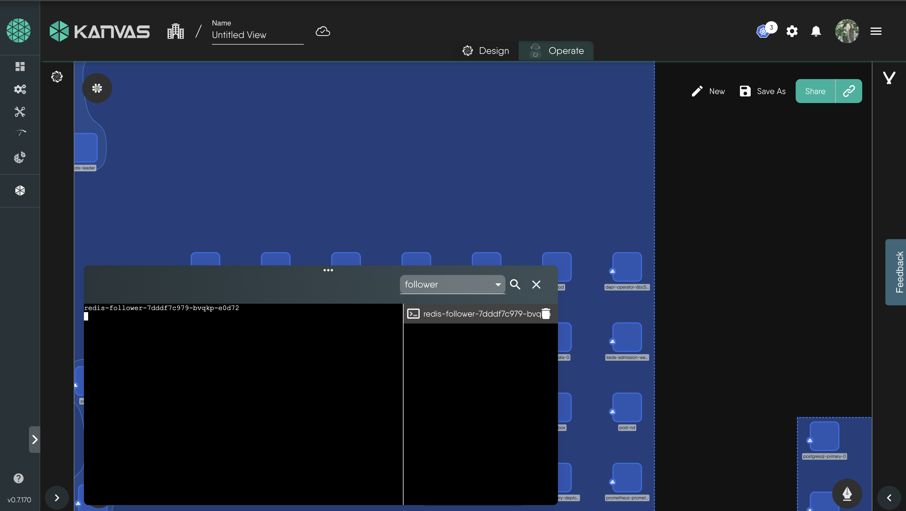

### Introduction

In this tutorial, we will learn how to deploy a **PHP Guestbook application with Redis** using Meshery Playground. Meshery Playground is an interactive and collaborative live cluster environment that simplifies the deployment process and enhances user experience by providing visual tools for managing Kubernetes resources.

> **NOTE:** If this is your first time working with Meshery Playground, consider starting with the [Exploring Kubernetes Pods with Meshery Playground](https://docs.meshery.io/guides/tutorials/kubernetes-pods) tutorial first.

### Prerequisites
- Basic understanding of Kubernetes concepts.
- Meshery Playground access. If you don't have an account, sign up at [Meshery Playground](https://meshery.layer5.io/play).

### Lab Scenario
- Import the PHP and Redis manifest files into Meshery Playground.
- Deploy these resources on the playground.
    - Start up a Redis leader.
    - Start up two Redis followers.
    - Start up the guestbook frontend.
- Expose and view the Frontend Service.


### Objective
Learn how to import manifest files, visualize Kubernetes resources, create new resource components, and deploy the application using Meshery Playground.


### Steps

#### Download the Kubernetes Configuration Files

To get started we will need some yaml files that will contain the configurations for the pods and services that will run on Meshery. Go ahead and download them.
1. [redis-leader-deployment.yaml](https://k8s.io/examples/application/guestbook/redis-leader-deployment.yaml)
2. [redis-leader-service.yaml](https://k8s.io/examples/application/guestbook/redis-leader-service.yaml)
3. [redis-follower-deployment.yaml](https://k8s.io/examples/application/guestbook/redis-follower-deployment.yaml)
4. [redis-follower-service.yaml](https://k8s.io/examples/application/guestbook/redis-follower-service.yaml)
5. [frontend-deployment.yaml](https://k8s.io/examples/application/guestbook/frontend-deployment.yaml)
6. [frontend-service.yaml](https://k8s.io/examples/application/guestbook/frontend-service.yaml)

These YAML files contain the Service definitions and Deployment configurations for the PHP app with Redis.

#### Accessing Meshery Playground

1. Log in to the [Meshery Playground](https://meshery.layer5.io/) using your credentials. On successful login, you should be at the dashboard. Press the **X** on the _Where do you want to start?_ popup to close it (if required).

2. Click **Explore** in the Cloud Native Playground tile to navigate to _MeshMap_


#### Import the Files to Meshery Playground

1. In the left sidebar, click on the upward arrow symbol(import icon) to import the designs into Meshery.

2. On doing so, a modal appears.In the modal that appears, enter a name for your design in the "Design File Name" field (e.g.`redis-leader-deployment`).

3. Now select `Kubernetes Manifest` from the "Design Type" dropdown menu.

4. Then choose `URL Import` for the upload method.

5. Now input the URL.

6. Then, click on `Import`




Now, follow the same steps (1-6) to import the rest of the files.

Under the “Designs” tab, you will see that we have successfully imported the manifest as designs, then you can drag and drop them in the canvas. This will "Merge" all the designs since it's all just one application


#### 4. **Deploy the files:**

1. Click Actions in the top right corner and click on Deploy.


1. The design will be validated to make sure there are no errors.

1. Choose the Kubernetes cluster you want to deploy to.

1. A Dry-Run will be triggered.

1. Finally your deployment and click Deploy to deploy the application to the cluster.

1. On sucessful deployment you will see the following modal asking yout o open you deployment in visualizer


#### 5. **Updating the Deployments:**

```bash
kubectl set image deployment/<deployment-name> <container-name>=new-image:tag
```


#### 6. Open the files in Operate

1. Once deployment is successful user can click on Open in Operate, or click on notification on top right click on the deployment successfull notification and click on Open in Operate, or directly click on the Operate tab beside Design on the design and visualize the design inside operate mode.


2. Click on the Layers option below to view all available filters.

Now you can utilize this filter to visualize your design.


3. After selecting your filters, you should see a view displaying only your relevant resources.


#### 7. Using built-in terminal for logs

1. Right click on a pod, to open the circular-content menu.


2. Select the logs option from circular-context menu, this will start the session for logs

3. Now you can use the in built terminal to view logs



#### 8. Deleting the resources

To delete the resources, use the **Undeploy** option from the _Design_ view.


### Conclusion
Congratulations! You've successfully completed the lab on exploring Kubernetes Deployments using Meshery Playground. This hands-on experience has equipped you with practical knowledge on deploying, updating, and monitoring applications in a Kubernetes environment. Continue exploring more scenarios in the Meshery Playground to enhance your skills in container orchestration.
